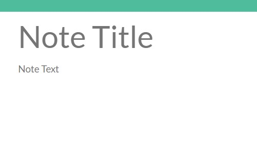
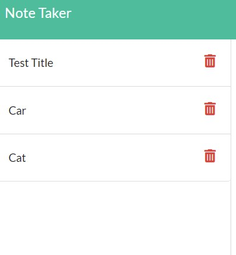

# Note Taker 

## Description
This is a program that will store notes that you take in order to stay organized.

## Add Note
You are able to add a note, all you need is a title and text! Once you enter both fields, a save icon appears at the top of the screen.

## Current Notes
You will see the current notes listed on the left-hand column. 

## Deployed Site
You are able to use this site via Heroku here: https

## Built With
This website uses the following:
* HTML
* CSS
* Javascript
